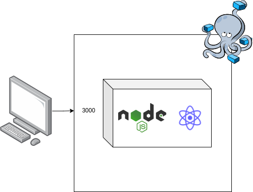

<h1> Meu Blog </h1>

 Olá sejam bem-vindos ao meu blog, aqui vocês poderam ver informações sobre minha vida acadêmica e profissional. Informações essas que considero importantes para o mercado de trabalho. 

<h2> Arquitetura do Sistema </h2>

<h2> Requisitos do Sistema </h2>

<ul>
    <li> Docker </li>
    <li> docker-compose </li>
</ul>

<h2> Comando para subir a aplicação </h2>
<blockquote> docker-compose up </blockquote>

<h2> Acessando aplicação </h2>
<a> localhost:3000 </a>